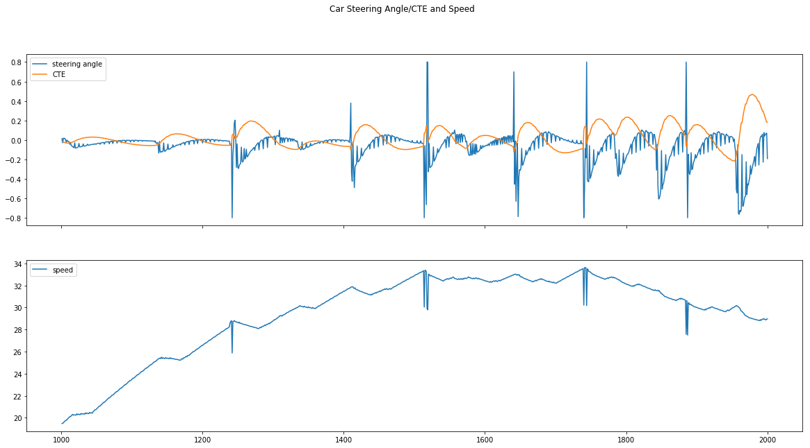
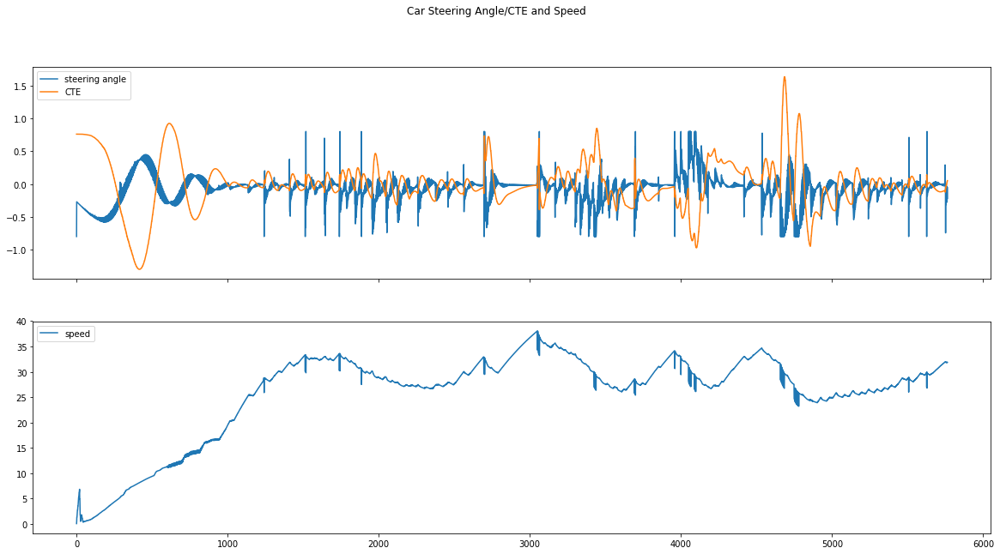

# Write Up

In this project, given the cross track error (CTE) and the velocity (mph) of the simulated vehicle, I implement a PID controller to compute the appropriate steering angle so that the vehicle always drives within the road boundaries.

My implementation in the `PID.cpp` is very straightforward. I spent most of my efforts tuning three coefficients of the controller manually because the most thing I want to know about the PID controller is how these coefficients impact the final output.

I follow the manual tuning strategy from the reference [1] below:

> Manual tuning is done by setting the reset time to its maximum value and the rate to zero and increasing the gain until the loop oscillates at a constant amplitude. When the response to an error correction occurs quickly a larger gain can be used. If response is slow a relatively small gain is desirable.

According to my observation, the *gain factor*, namely, proportional coefficient `Kp` has the most significant impacts on the outputs. I first try a relatively large value, 1, the car swifts wildly and rushes to the bushes or the river finally, while the CTE keeps on increasing. So I gradually reduce this value by `0.05` from `0.75` to `0.05`, and find that when the value is between `0.35` to `0.25`, the car drives itself more stable than using the other values. I also try large gain like `2.0`, the car quickly runs out of the lane. Similarly, I use this strategy to tune the coefficients of `Ki` and `Kd`.

Moreover, the PID controller may output very large steering angle if the CTE value is large, for example, when CTE is greater than `1.0`. In this scenario, I set the upper bound value and the lower bound value for the steering angle to `0.8` and `-0.8`, respectively. Meanwhile, when the steering angle is large, I let the car speed down in case of the drifting.

In this figure, the above figure plots the car's CTE and steering angle, and the below figure plots the car's velocity during one test run. The x-axis is the internal steps of the car's computing unit.  
From the figure, we can see around the 1250 steps, 1500 steps, 1750 steps and 1900 steps, the steering angles reach the upper and lower bounds, the car reduce its velocity each step by 10% less.

After the car completes one loop in the simulated environment, the plots of CTE/steering angle and the velocity against the computation steps are shown below:

## References
[1] [Tuning a PID Controller](https://www.omega.com/technical-learning/tuning-a-pid-controller.html)
